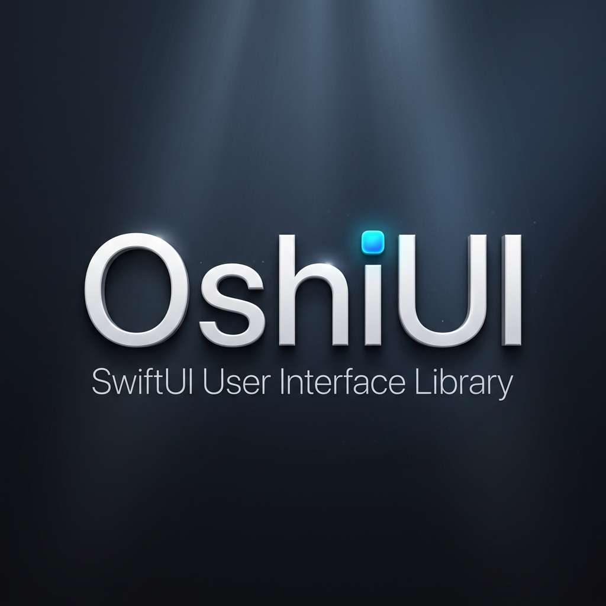

<p align="center">
  <picture>
    <source media="(prefers-color-scheme: dark)" srcset="Assets/oshiui-banner.png" />
    <source media="(prefers-color-scheme: light)" srcset="Assets/oshiui-banner.png" />
    
  </picture>
</p>

<p align="center">
  
  
  
  
  
  
</p>

<p align="center">
  <strong>推し — Your favorite UI, elevated.</strong><br/>
  <em>A futuristic, physics-driven SwiftUI component library for iOS, macOS, and visionOS.</em>
</p>

<p align="center">
  <code>Neon Glows</code> · <code>Glass Depth</code> · <code>Kinetic Haptics</code> · <code>Spatial Holograms</code> · <code>AI-Ready Interfaces</code>
</p>

---

## Overview

**OshiUI** is a modular, production-grade UI framework that transforms flat SwiftUI interfaces into immersive, physics-aware experiences. Built with Swift 6 strict concurrency, it ships as 8 independently adoptable modules — from atomic design tokens to volumetric visionOS controls.

### Quick Start

```swift
import OshiUI

struct ContentView: View {
    var body: some View {
        VStack(spacing: OshiSpacing.lg) {
            // Neon-glowing glassmorphism card
            OshiLayeredCard(depth: .deep, accentColor: .oshiCyan) {
                VStack(spacing: OshiSpacing.md) {
                    Text("Welcome to OshiUI")
                        .font(OshiTypography.title2)
                        .foregroundStyle(OshiColor.textPrimary)

                    Text("Physics-driven. Neon-lit. Spatial-ready.")
                        .font(OshiTypography.callout)
                        .foregroundStyle(OshiColor.textSecondary)
                }
                .padding(OshiSpacing.xl)
            }

            // Volumetric 3D button with spring physics
            OshiVolumetricButton("Get Started") {
                // Action with built-in depth animation
            }

            // Kinetic progress bar with haptic momentum
            OshiProgressBar(value: 0.75, style: .kinetic)
                .oshiProgressGlow(OshiColor.neonLime)
        }
        .padding(OshiSpacing.xl)
        .background(OshiColor.surfaceDeep)
    }
}
```

---

## Modules

OshiUI is organized into 8 focused modules. Import only what you need, or use the umbrella `OshiUI` product for everything.

| Module | Description | Key Components | Phase |
|--------|-------------|----------------|-------|
| **`OshiUICore`** | Atomic design tokens — colors, typography, spacing, neon glow engine | `OshiColor`, `OshiTypography`, `OshiSpacing`, `OshiPlatform` | 1 |
| **`OshiUISpatial`** | Glassmorphism, 3D layered cards, volumetric depth effects | `GlassmorphismModifier`, `OshiLayeredCard`, `OshiVolumetricButton` | 2 |
| **`OshiUIKinetic`** | Spring physics, haptic feedback, morphing flow animations | `KineticImpactButtonStyle`, `OshiMorphView`, `OshiHapticEngine` | 2 |
| **`OshiUINoir`** | High-contrast cyberpunk components, futuristic toast notifications | `OshiNoirCard`, `OshiToast`, `OshiNoirDivider` | 3 |
| **`OshiUIHUD`** | Kinetic progress bars, glowing achievement badges, radar charts | `OshiProgressBar`, `OshiAchievementBadge`, `OshiRadarChart` | 3 |
| **`OshiUIHolographic`** | Spatial parallax canvas, volumetric floating panels | `OshiHolographicCanvas`, `OshiVolumetricPanel` | 4 |
| **`OshiUISynapse`** | Streaming text renderer, particle "thinking" animations, chat UI | `OshiStreamingText`, `OshiThinkingParticles`, `OshiChatView` | 4 |
| **`OshiUICanvas`** | Grid layouts with snap alignment, resizable modular widgets | `OshiSnapGrid`, `OshiResizableWidget` | 5 |

### Module Dependency Graph

```
                    ┌─────────────┐
                    │   OshiUI    │  (Umbrella)
                    └──────┬──────┘
           ┌───────────────┼───────────────┐
           │               │               │
     ┌─────┴─────┐  ┌─────┴─────┐  ┌─────┴─────┐
     │  Spatial   │  │  Kinetic  │  │   Core    │
     └─────┬─────┘  └─────┬─────┘  └───────────┘
           │               │               ▲
     ┌─────┴─────┐  ┌─────┴─────┐         │
     │Holographic│  │   Noir    │    (all depend
     │  Canvas   │  │   HUD     │     on Core)
     └───────────┘  │  Synapse  │
                    └───────────┘
```

> **Tip:** Import `OshiUICore` alone for zero transitive dependencies, or progressively adopt higher modules as needed.

---

## Installation

### Swift Package Manager (Recommended)

Add OshiUI to your `Package.swift`:

```swift
dependencies: [
    .package(url: "https://github.com/MrDavudGunduz/OshiUI.git", from: "1.0.0")
]
```

Then add the desired module to your target:

```swift
.target(
    name: "YourApp",
    dependencies: [
        .product(name: "OshiUI", package: "OshiUI"),       // Full suite
        // — or pick individual modules —
        // .product(name: "OshiUICore", package: "OshiUI"),
        // .product(name: "OshiUISpatial", package: "OshiUI"),
    ]
)
```

### Xcode

1. **File → Add Package Dependencies…**
2. Enter `https://github.com/MrDavudGunduz/OshiUI.git`
3. Select the modules you need

---

## Feature Highlights

### 🎨 Neon Color Engine

```swift
// Curated neon palette with gradient factories
Text("Neon Title")
    .foregroundStyle(OshiColor.neonCyan)
    .oshiNeonGlow(.oshiCyan, radius: 12)

RoundedRectangle(cornerRadius: 12)
    .fill(OshiColor.gradient(.neonCyan, .neonMagenta))
```

### 🧊 Glassmorphism

```swift
// Frosted glass with automatic accessibility fallback
content
    .oshiGlassmorphism(blur: 25, tint: .blue.opacity(0.1))
```

### ⚡ Spring Physics & Haptics

```swift
// Buttons that physically push back
Button("Save") { save() }
    .buttonStyle(.oshiKineticImpact(intensity: .heavy, accentColor: .oshiLime))

// Organic morph transitions
OshiMorphView(isExpanded: $isOpen, spring: .bouncy) {
    CompactView()
} expanded: {
    DetailView()
}
```

### 🏆 Gamification HUD

```swift
// Animated radar chart
OshiRadarChart(
    data: [0.8, 0.6, 0.9, 0.5, 0.7],
    axes: ["ATK", "DEF", "SPD", "INT", "LCK"]
)

// Achievement badges with tier-based glow
OshiAchievementBadge(title: "Champion", tier: .gold, isUnlocked: true)
```

### 🤖 AI/LLM Interfaces

```swift
// Streaming text with animation-suppressed rendering for smooth token display
OshiStreamingText(text: viewModel.streamedText)
    .oshiStreamCursor(.pulse)

// Neural thinking particles
OshiThinkingParticles(style: .neural, color: OshiColor.neonCyan)
```

---

## Accessibility

OshiUI treats accessibility as a **first-class architectural concern**, not an afterthought. Every component respects system accessibility preferences automatically:

| Setting | Components Affected |
|---------|-------------------|
| **Reduce Motion** | `OshiVolumetricButtonStyle`, `KineticImpactButtonStyle`, `OshiLayeredCard`, `OshiProgressBar`, `OshiNeonGlowModifier`, `OshiHolographicCanvas`, `OshiRadarChart`, `OshiAchievementBadge`, `OshiThinkingParticles` |
| **Reduce Transparency** | `GlassmorphismModifier` |
| **VoiceOver** | All interactive components with labels, traits, values, and hints |
| **Dynamic Type** | Full support via `OshiTypography` token system |

> When Reduce Motion is enabled, spring animations fall back to eased transitions, parallax effects are disabled, and particle systems show static indicators — all without any configuration.

---

## Requirements

| Requirement | Minimum |
|-------------|---------|
| Swift | 6.0 |
| iOS | 18.0+ |
| macOS | 15.0+ |
| visionOS | 2.0+ |
| Xcode | 26.0+ |

---

## Architecture Principles

1. **Modular by Design** — Each module is independently compilable and adoptable. No monoliths.
2. **Identifiable-First** — All list and grid data structures use dynamic `Identifiable` conformance. Hardcoded indices are architecturally prohibited.
3. **Swift 6 Concurrency** — Strict `Sendable` compliance across all public API surfaces. `@MainActor` isolation where required.
4. **Platform Adaptive** — Automatic behavior adaptation across iOS, macOS, and visionOS via the `OshiPlatform` compile-time abstraction layer.
5. **Zero-Configuration Defaults** — Every component works beautifully out of the box while remaining deeply customizable.
6. **Accessibility-First** — All components include VoiceOver labels, traits, and Dynamic Type support. `Reduce Motion` and `Reduce Transparency` are respected automatically across the entire framework.

---

## Documentation

Full API documentation is available via Apple DocC:

```bash
# Generate documentation locally
swift package generate-documentation --target OshiUICore

# Generate for any module
swift package generate-documentation --target OshiUISpatial
swift package generate-documentation --target OshiUIKinetic
```

Each module includes:
- API reference with inline code examples
- Architecture articles explaining design decisions
- SwiftUI Preview catalog for visual exploration

Available DocC articles:
- [Getting Started with OshiUICore](Sources/OshiUICore/OshiUICore.docc/GettingStartedWithCore.md)
- [Design Token Guide](Sources/OshiUICore/OshiUICore.docc/DesignTokenGuide.md)

---

## Project Status

| Phase | Modules | Status |
|-------|---------|--------|
| **Phase 1: Foundation** | OshiUICore | ✅ Complete |
| **Phase 2: Depth & Physics** | OshiUISpatial, OshiUIKinetic | ✅ Complete |
| **Phase 3: Identity & Gamification** | OshiUINoir, OshiUIHUD | ✅ Complete |
| **Phase 4: Spatial & AI** | OshiUIHolographic, OshiUISynapse | ✅ Complete |
| **Phase 5: Flexible Workspaces** | OshiUICanvas | ✅ Complete |
| **Phase 6: Polish & Hardening** | Accessibility, CI/CD, Testing, API consistency | ✅ Complete |
| **Phase 7: Stable Release** | Gallery app, snapshot tests, perf benchmarks, docs | 🔄 In Progress |

See our [Roadmap](ROADMAP.md) for the full v1.0.0 → v2.0.0 plan including the dynamic theming engine, interactive input components, and Metal shader integration.

---

## Quality Metrics

| Metric | Value |
|--------|-------|
| Tests | 136 across 35 suites |
| Build warnings | 0 |
| External dependencies | 0 |
| CI matrix | iOS 18, macOS 15, visionOS 2 |
| Coverage enforcement | 70% minimum per module |
| DocC CI verification | All 8 modules |

---

## Contributing

We welcome contributions! Please read our [Contributing Guide](CONTRIBUTING.md) before submitting a pull request.

See the [Roadmap](ROADMAP.md) for current contribution priorities and upcoming milestones.

---

## License

OshiUI is released under the **MIT License**. See [LICENSE](LICENSE) for details.

---

<p align="center">
  <sub>Built with ♥ by <a href="https://github.com/MrDavudGunduz">Davud Gunduz</a></sub><br/>
  <sub>推し — Because your UI deserves to be someone's favorite.</sub>
</p>
