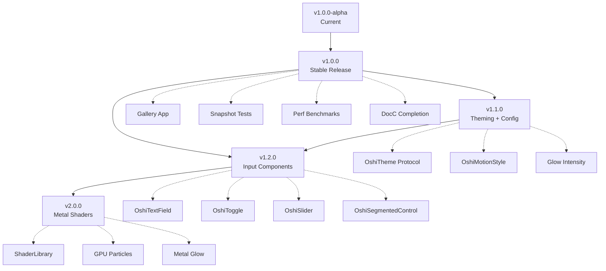

# OshiUI — Roadmap

> **Last Updated:** 2026-05-12  
> **Current Version:** `1.0.0-alpha`  
> **Target Release:** `v1.0.0` — Q3 2026

This roadmap outlines the evolution of OshiUI from a component library into a **full-featured, enterprise-grade Design System**. Each milestone is prioritized by business impact, developer demand, and architectural readiness.

---

## Where We Are

OshiUI ships 8 production-ready modules with 30+ components covering neon aesthetics, glassmorphism, spring physics, haptic feedback, gamification HUD, holographic depth, AI/LLM streaming interfaces, and flexible workspaces.

| Metric        | Current                         |
| ------------- | ------------------------------- |
| Modules       | 8 + 1 umbrella                  |
| Components    | 30+                             |
| Test Coverage | 148 tests across 38 suites      |
| Platforms     | iOS 18+, macOS 15+, visionOS 2+ |
| Swift         | 6.0 strict concurrency          |
| Dependencies  | Zero external                   |

**Completed Phases:**

| Phase                             | Scope                                                                                 | Status |
| --------------------------------- | ------------------------------------------------------------------------------------- | ------ |
| Phase 1 — Foundation              | Design tokens, color engine, typography, platform abstractions                        | ✅     |
| Phase 2 — Depth & Physics         | Glassmorphism, layered cards, volumetric buttons, spring physics, haptics             | ✅     |
| Phase 3 — Identity & Gamification | Cyberpunk cards, toast notifications, progress bars, achievement badges, radar charts | ✅     |
| Phase 4 — Spatial & AI            | Holographic canvas, volumetric panels, streaming text, thinking particles, chat UI    | ✅     |
| Phase 5 — Workspaces              | Snap grids, resizable widgets                                                         | ✅     |
| Phase 6 — Polish & Hardening      | Accessibility, CI/CD, test expansion, API consistency                                 | ✅     |

---

## Where We're Going

```
             v1.0.0-alpha          v1.0.0             v1.1.0             v1.2.0            v2.0.0
────────────────┤──────────────────────┤──────────────────┤──────────────────┤─────────────────┤
                │                      │                  │                  │                 │
         ► YOU ARE HERE           Stable API          Theming &          Inputs &         Metal &
                               Freeze + Gallery     Configuration     Extensions        Shaders
```

---

## Milestone 1 — Stable Release (`v1.0.0`)

**Target:** Q3 2026  
**Theme:** _API Freeze, Quality Gate, Developer Onboarding_

This transformation aims to bring OshiUI from the "alpha" label to a reliably usable release. No new components are added; the focus is entirely on stability, test depth, and developer experience.

### 1.1 — Visual Regression Testing Infrastructure

Existing unit tests perform logical validation. However, a professional UI library requires **visual regression testing**.

| Deliverable                    | Detail                                                                  |
| ------------------------------ | ----------------------------------------------------------------------- |
| Snapshot testing infrastructure | Integration with `swift-snapshot-testing` for pixel-level validation    |
| Device matrix                   | iPhone 16 Pro, iPad Pro 13", Mac (Retina), Apple Vision Pro             |
| Mode matrix                     | Dark Mode, Light Mode, Reduce Motion ON/OFF, Reduce Transparency ON/OFF |
| CI integration                  | Workflow that automatically embeds snapshot diffs into PR comments       |
| Baseline management             | `__Snapshots__` reference directory for each module                     |

```
Tests/
├── OshiUICoreTests/
│   ├── OshiUICoreTests.swift
│   └── __Snapshots__/
│       ├── OshiNeonGlow_iPhone16Pro_Dark.png
│       └── OshiNeonGlow_iPhone16Pro_ReduceMotion.png
```

### 1.2 — Performance Benchmarking

Test scenarios ensuring that render-intensive components stay within the frame budget.

| Component                                        | Target | Metric                    |
| ------------------------------------------------ | ------ | ------------------------- |
| `OshiThinkingParticles` (16 particle, `.spiral`) | 60fps  | `XCTMetric.wallClockTime` |
| `OshiRadarChart` (8 axis, animated)              | 60fps  | Frame drop count < 2      |
| `OshiHolographicCanvas` (continuous hover)       | 60fps  | CPU usage < 15%           |
| `OshiStreamingText` (100 tokens/sec)             | 60fps  | Memory growth < 1MB/min   |

### 1.3 — OshiUI Gallery App

A demo application included in the package, enabling live exploration of all modules.

```
OshiUIGallery/
├── OshiUIGalleryApp.swift
├── Screens/
│   ├── CoreScreen.swift          — Color palette, typography scale
│   ├── SpatialScreen.swift       — Glassmorphism, layered cards
│   ├── KineticScreen.swift       — Spring buttons, morph views
│   ├── NoirScreen.swift          — Cyberpunk cards, toast demos
│   ├── HUDScreen.swift           — Progress bars, badges, radar
│   ├── HolographicScreen.swift   — Parallax canvas, panels
│   ├── SynapseScreen.swift       — Streaming text, chat, particles
│   └── CanvasScreen.swift        — Snap grids, resizable widgets
└── Shared/
    └── GalleryNavigation.swift
```

### 1.4 — Enriched SwiftUI Previews

Current Previews offer static snapshots. By using `@Previewable` states, developers can **interactively test parameters without writing code**.

```swift
#Preview("Progress Bar — Interactive") {
    @Previewable @State var progress: Double = 0.5
    @Previewable @State var style: OshiProgressStyle = .kinetic

    VStack(spacing: OshiSpacing.lg) {
        OshiProgressBar(value: progress, style: style)
        Slider(value: $progress, in: 0...1)
        Picker("Style", selection: $style) {
            Text("Standard").tag(OshiProgressStyle.standard)
            Text("Kinetic").tag(OshiProgressStyle.kinetic)
            Text("Instant").tag(OshiProgressStyle.instant)
        }
        .pickerStyle(.segmented)
    }
    .padding()
    .background(OshiColor.surfaceDeep)
}
```

### 1.5 — Documentation Completion

| Target                  | Scope                                                                        |
| ----------------------- | ---------------------------------------------------------------------------- |
| DocC tutorial articles  | "Getting Started" + "Advanced Customization" articles for all 8 modules      |
| GitHub Pages deployment | Automated DocC build + publish to `gh-pages` branch in CI                    |
| Migration guide         | `v0.x` → `v1.0.0` breaking change guide (deprecated API list)               |
| API diff report         | Automated API surface control using Xcode's `swift-api-digester` tool        |

---

## Milestone 2 — Dynamic Theming Engine (`v1.1.0`)

**Target:** Q4 2026  
**Theme:** _Brand Compatibility, Protocol-Based Theming System_

In the current architecture, values in `OshiColor`, `OshiTypography`, and `OshiSpacing` are defined statically. This milestone establishes a **protocol-based theming system** that allows users to inject their own brand colors.

### 2.1 — `OshiTheme` Protocol

```swift
/// A protocol defining the complete visual identity for OshiUI components.
public protocol OshiTheme: Sendable {

    // ── Colors ──────────────────────────────────────
    var primaryAccent: Color { get }
    var secondaryAccent: Color { get }
    var surfaceDeep: Color { get }
    var surfaceElevated: Color { get }
    var surfaceFloating: Color { get }
    var textPrimary: Color { get }
    var textSecondary: Color { get }
    var textTertiary: Color { get }

    // ── Typography ──────────────────────────────────
    var displayFont: Font { get }
    var titleFont: Font { get }
    var bodyFont: Font { get }
    var codeFont: Font { get }

    // ── Spacing ─────────────────────────────────────
    var spacingScale: OshiSpacingScale { get }

    // ── Motion ──────────────────────────────────────
    var motionStyle: OshiMotionStyle { get }
    var glowIntensity: Double { get }
}
```

### 2.2 — Environment Integration

Theme switching for all child components through a single point using SwiftUI's `@Environment` mechanism:

```swift
// Theme injection at the app root
ContentView()
    .environment(\.oshiTheme, BrandTheme())

// Components automatically consume theme values
struct BrandTheme: OshiTheme {
    var primaryAccent: Color { .blue }
    var secondaryAccent: Color { .orange }
    // ... brand values
}
```

### 2.3 — Built-in Theme Presets

| Theme                 | Description                                                         |
| --------------------- | ------------------------------------------------------------------- |
| `OshiNeonTheme`       | Current default — cyan/magenta neon palette (backward compatible)   |
| `OshiMonochromeTheme` | Black-and-white minimalist theme                                    |
| `OshiOceanTheme`      | Ocean blue gradients, calm aesthetic                                |
| `OshiSolarTheme`      | Warm amber/orange tones                                             |

### 2.4 — Theme Migration Strategy

Existing static accessors like `OshiColor.neonCyan` will be marked as **deprecated** but will continue to work. The new API enables components to read colors via `@Environment(\.oshiTheme)`. This ensures:

- Existing users can update with **zero breaking changes**
- New users can immediately inject custom themes
- Runtime theme switching (dark/light toggle) is naturally supported

---

## Milestone 3 — Global Configuration & Accessibility (`v1.1.0`)

**Target:** Q4 2026 (parallel with Milestone 2)  
**Theme:** _Centralized Control, Accessibility Standard_

### 3.1 — `OshiMotionStyle` — Global Motion Control

Controlling the speed or stiffness of spring animations in the `OshiUIKinetic` module through a global configuration:

```swift
/// Global motion behavior configuration.
public struct OshiMotionStyle: Sendable, Equatable {
    /// Spring response multiplier (1.0 = default, 0.5 = twice as fast).
    public var springResponseScale: Double
    /// Spring damping multiplier.
    public var dampingScale: Double
    /// Whether animations are globally enabled.
    public var animationsEnabled: Bool

    public static let `default` = OshiMotionStyle(
        springResponseScale: 1.0,
        dampingScale: 1.0,
        animationsEnabled: true
    )

    /// Subdued motion — slower, more damped animations for subtle interfaces.
    public static let subdued = OshiMotionStyle(
        springResponseScale: 1.5,
        dampingScale: 1.2,
        animationsEnabled: true
    )
}
```

**Usage:**

```swift
ContentView()
    .environment(\.oshiMotionStyle, .subdued)
```

### 3.2 — Global Glow Intensity Control

Setting the application's overall "brightness" level for `OshiNeonGlowModifier` from a single location:

```swift
// Reduce glow by half (performance or aesthetic preference)
ContentView()
    .environment(\.oshiGlowIntensity, 0.5)

// Disable glow completely
ContentView()
    .environment(\.oshiGlowIntensity, 0.0)
```

### 3.3 — Comprehensive Reduce Motion Coverage

Binding all `OshiSpringPreset` values to the `accessibilityReduceMotion` setting:

| Current                                                     | Enhancement                                         |
| ----------------------------------------------------------- | --------------------------------------------------- |
| `OshiSpringPreset.animation` always returns spring          | Falls back to `.easeInOut` when Reduce Motion is on  |
| `OshiMorphView` spring animation                            | Instant transition when Reduce Motion is on          |
| `OshiToast` slide-in animation                              | Fade-only transition when Reduce Motion is on        |

---

## Milestone 4 — Interactive Input Components (`v1.2.0`)

**Target:** Q1 2027  
**Theme:** _Form Components, Futuristic Input Layer_

The project currently focuses primarily on "display" components. This milestone equips OshiUI with a full form system.

### 4.1 — `OshiTextField`

Neon focus ring, "glitch" effect on error state, and glow animation:

```swift
OshiTextField("Username", text: $username)
    .oshiTextFieldStyle(.neon)            // Neon focus ring
    .oshiValidation(.error("Too short"))  // Glitch shake + red glow

// Supported styles
public enum OshiTextFieldStyle: Sendable {
    case neon       // Default — neon focus glow
    case glass      // Glassmorphism background
    case noir       // Cyberpunk sharp edges
    case minimal    // Underline only
}
```

**Features:**

- Neon focus ring animation (color sourced from theme)
- "Glitch" shake effect + red glow transition on error state
- Only border color changes when `accessibilityReduceMotion` is enabled
- Character counter (optional), inline error message support
- Secure text entry mode (password field)

### 4.2 — `OshiToggle`

Physics-based toggle component with haptic feedback:

```swift
OshiToggle("Dark Mode", isOn: $isDark)
    .oshiToggleStyle(.kinetic)  // Spring physics toggle
    .tint(OshiColor.neonLime)

// "Cooling down" glow effect when toggle turns off
// Neon "ignition" effect when toggle turns on
```

**Features:**

- Toggle knob animation with spring physics
- `OshiHapticEngine.impact(.light)` trigger on toggle on/off
- Neon glow trail effect (trail following knob movement)
- `OshiToggleStyle`: `.kinetic`, `.glass`, `.noir`

### 4.3 — `OshiSlider`

Physics-based slider component:

```swift
OshiSlider(value: $volume, in: 0...100)
    .oshiSliderStyle(.neon)
    .oshiSliderHaptics(.stepped(every: 10))  // Haptic tick every 10 units

// Stepped haptic: tactile feedback when user reaches specific intervals
```

**Features:**

- Neon glow effect on the thumb
- Fill gradient on the track
- Stepped haptic feedback (configurable interval)
- Min/max label support
- `@Environment(\.oshiTheme)` color integration

### 4.4 — `OshiSegmentedControl`

Neon-lit segmented picker:

```swift
OshiSegmentedControl(selection: $tab) {
    OshiSegment("Overview", systemImage: "chart.bar.fill")
    OshiSegment("Details", systemImage: "doc.text.fill")
    OshiSegment("Settings", systemImage: "gearshape.fill")
}
```

---

## Milestone 5 — Metal Shader Integration (`v2.0.0`)

**Target:** Q2 2027  
**Theme:** _GPU-First Rendering, Main Thread Liberation_

This milestone moves CPU-bound Canvas animations entirely to the GPU for maximum performance. It leverages the `visualEffect` API and custom Metal shader programs available from iOS 17+.

### 5.1 — Canvas → Metal Shader Migration

| Component                | Current (CPU)                 | Target (GPU)                          |
| ------------------------ | ----------------------------- | ------------------------------------- |
| `OshiThinkingParticles`  | `Canvas` + `TimelineView`     | Metal compute shader + `visualEffect` |
| `OshiNeonGlowModifier`   | Layered `.shadow()` modifiers | Metal fragment shader glow            |
| `OshiHolographicCanvas`  | `rotation3DEffect` transforms | Metal vertex shader parallax          |
| `OshiNoirCard` scan-line | `Canvas` overlay pattern      | Metal fragment shader                 |

### 5.2 — Custom `ShaderLibrary` Integration

```swift
// OshiUI Metal shader bundle
extension ShaderLibrary {
    /// Neon glow shader — single-pass GPU glow effect.
    static let oshiNeonGlow = ShaderLibrary.bundle(.module).neonGlow

    /// Particle field shader — GPU-driven particle system.
    static let oshiParticleField = ShaderLibrary.bundle(.module).particleField

    /// Holographic sheen — iridescent surface shader.
    static let oshiHolographicSheen = ShaderLibrary.bundle(.module).holographicSheen
}


Text("ONLINE")
    .visualEffect { content, proxy in
        content.layerEffect(
            ShaderLibrary.oshiNeonGlow(
                .float(proxy.size.width),
                .float(proxy.size.height),
                .color(OshiColor.neonCyan)
            ),
            maxSampleOffset: .zero
        )
    }
```

### 5.3 — Performance Targets

| Metric                                | v1.x (Canvas)   | v2.0 (Metal)  |
| ------------------------------------- | --------------- | ------------- |
| `OshiThinkingParticles` CPU usage     | ~8–12%          | < 2%          |
| `OshiNeonGlowModifier` render passes  | 3 shadow layers | 1 shader pass |
| `OshiHolographicCanvas` frame time    | ~4ms            | < 1ms         |
| Battery impact (continuous animation) | Moderate        | Minimal       |

### 5.4 — Backward Compatibility

Metal shaders only run on iOS 17+ / macOS 14+ / visionOS 1+. Existing Canvas implementations are preserved as fallbacks for older platform targets:

```swift
if #available(iOS 17, macOS 14, visionOS 1, *) {
    content.visualEffect { ... } // Metal shader path
} else {
    content.modifier(LegacyCanvasGlow()) // Canvas fallback
}
```

---

## Milestone Dependency Graph



---

## Contribution Priorities

To prioritize community contributions:

| Priority    | Area                                | Difficulty | Impact    |
| ----------- | ----------------------------------- | ---------- | --------- |
| 🔴 Critical | Snapshot testing infrastructure     | Medium     | High      |
| 🔴 Critical | `OshiTheme` protocol design         | High       | Very High |
| 🟠 High     | `OshiTextField` implementation      | Medium     | High      |
| 🟠 High     | Gallery app                         | Low–Medium | High      |
| 🟡 Medium   | Metal shader prototype (`neonGlow`) | High       | Medium    |
| 🟡 Medium   | `OshiToggle` & `OshiSlider`         | Medium     | Medium    |
| 🟢 Low      | Enriched interactive previews       | Low        | Medium    |
| 🟢 Low      | Theme preset packages               | Low        | Low       |

---

## Version Support Matrix

| OshiUI Version | Swift | iOS | macOS | visionOS | Status      |
| -------------- | ----- | --- | ----- | -------- | ----------- |
| `1.0.0-alpha`  | 6.0   | 18+ | 15+   | 2+       | **Current** |
| `1.0.0`        | 6.0   | 18+ | 15+   | 2+       | Q3 2026     |
| `1.1.0`        | 6.0   | 18+ | 15+   | 2+       | Q4 2026     |
| `1.2.0`        | 6.0+  | 18+ | 15+   | 2+       | Q1 2027     |
| `2.0.0`        | 6.0+  | 18+ | 15+   | 2+       | Q2 2027     |

---

## Guiding Principles

Architectural principles guiding this roadmap:

1. **Zero Breaking Changes Between Minors** — Existing APIs always continue to work across minor version transitions. New APIs are added with `@available`, old ones are marked with `@deprecated`.

2. **Performance Budget First** — No new component can be merged without a benchmark test proving it stays within the 60fps frame budget.

3. **Accessibility is Not Optional** — No interactive component can ship without VoiceOver, Dynamic Type, Reduce Motion, and Reduce Transparency support.

4. **Modular Adoption** — No milestone requires consumer apps to import all modules. One module, one dependency.

5. **Theme-Driven, Not Hardcoded** — From v1.1.0 onward, all visual values are read from the `OshiTheme` protocol; static constants remain as fallbacks.

---

<p align="center">
  <sub>This roadmap is a living document and is updated based on community feedback.</sub><br>
  <sub>Use <a href="https://github.com/MrDavudGunduz/OshiUI/discussions">GitHub Discussions</a> for suggestions.</sub>
</p>
